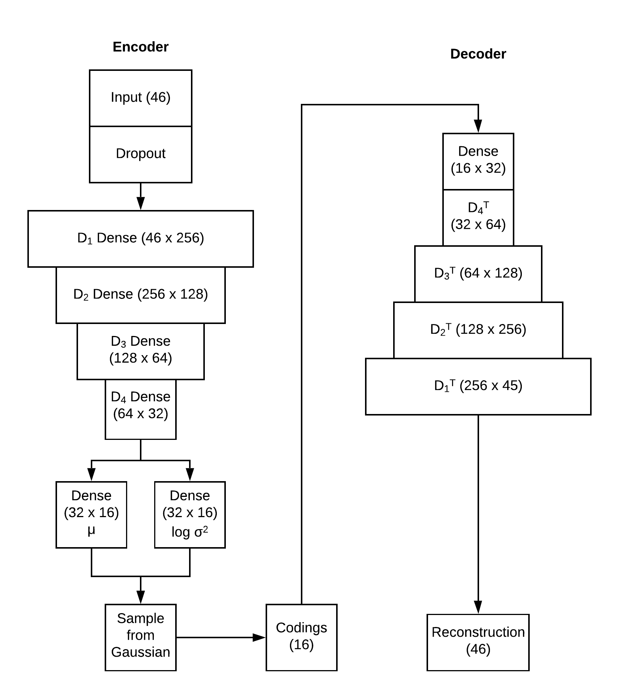

# picture-simulation
This is a simulation that can learn and generate synthetic electronic health record data.

* The variational autoencoder is based on code from this package https://github.com/ageron/handson-ml2

* generate_data_example.ipynb shows how to generate data and save it with this package

* train_comdel_example.ipynb shows how to train the variational autoencoder

* 20200120_data_scaler.pickle is the data scaler used in the simulation

* 20200120_simulation_model_weights.h5 is the trained variational autoencoder

* 20200120_simulated_data.pickle is example simulated data


### Model Structure



### Installation

The installation test was done on a CentOS 7.7 virtual machine with **Python 3.6.8** using `pip`

The [requirements.txt](https://github.com/MCIRCC/picture-simulation/blob/master/requirements.txt) file is included in the repository. The root dependencies are:

```txt
jupyterlab
keras
tensorflow
pandas
sklearn
matplotlib
seaborn
```

**Note:** 

The [pickle file](https://docs.python.org/3/library/pickle.html) built through [sklearn](https://scikit-learn.org/stable/) is with `sklearn` version 0.22. If `pip` installs a newer version of `sklearn`, you may get warning running Jupyter Notebook:

```python
sklearn/base.py:318: UserWarning: Trying to unpickle estimator StandardScaler from version 0.22 when using version 0.22.1. This might lead to breaking code or invalid results.
```

Please use your own judgement on whether or not staying with `sklearn` 0.22.

### Run

Running the simulation should be through two Jupyter Notebooks: [generate_data_example.ipynb](https://github.com/MCIRCC/picture-simulation/blob/master/generate_data_example.ipynb) and [train_model_example.ipynb](https://github.com/MCIRCC/picture-simulation/blob/master/train_model_example.ipynb)

If the installation is done properly, start up Jupyter Notebook on command line by:

```bash
jupyter notebook
```

If you are on a virtual environment, please activate the virtual environment first before running the command.
